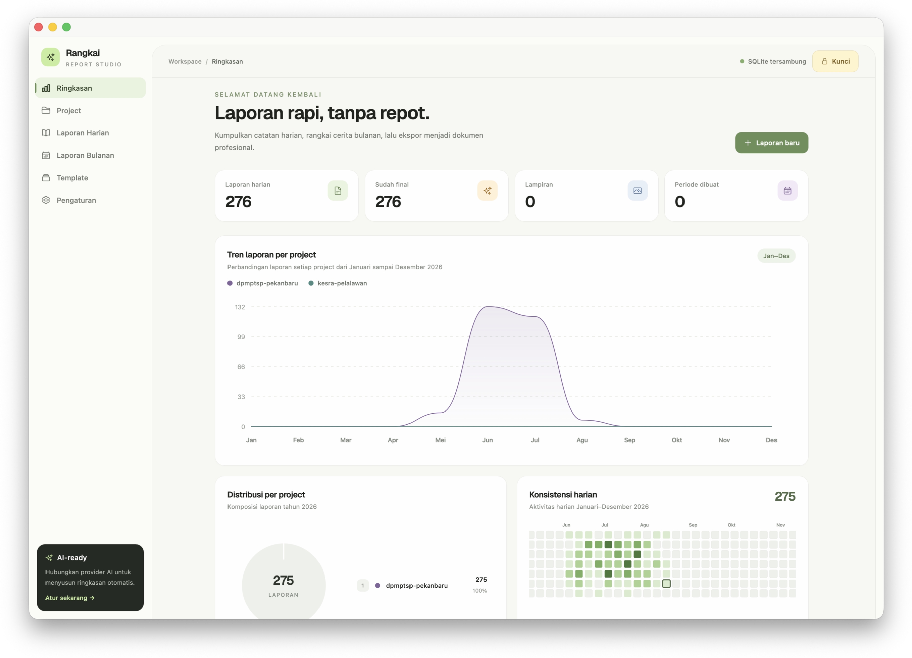
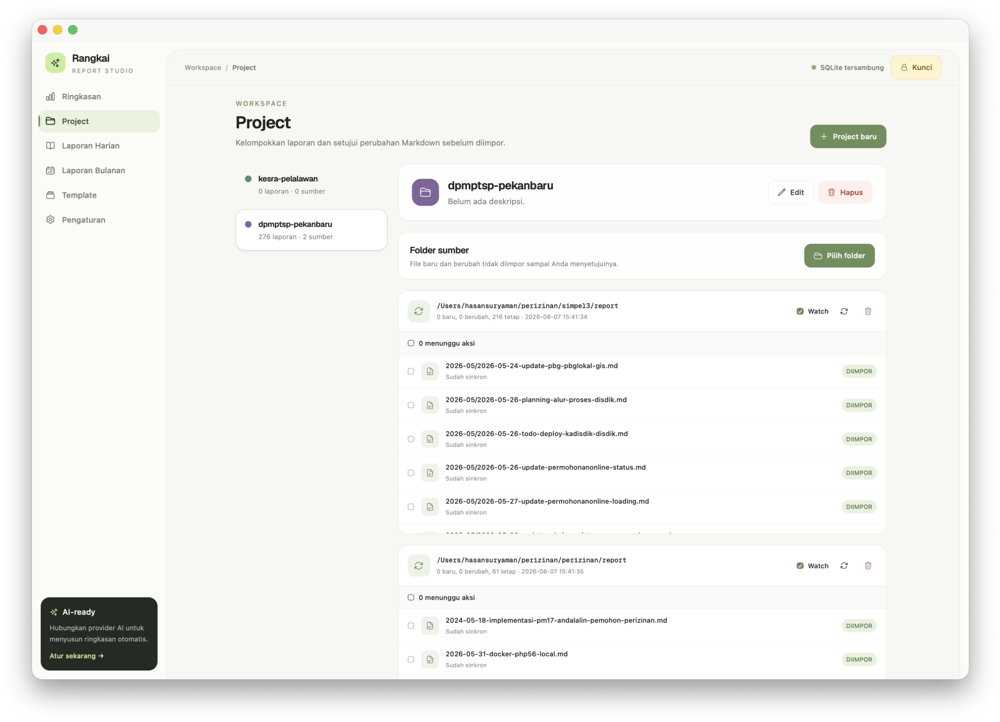

# Rangkai — Monthly Report Generator

Aplikasi lokal untuk mengumpulkan laporan harian berbasis Markdown dan menyusunnya menjadi laporan bulanan yang dapat diekspor ke Markdown atau PDF.

## Tampilan aplikasi

### Ringkasan



### Project



## Menjalankan aplikasi

Persyaratan: Node.js 20+ dan npm.

```bash
npm install
npm run dev
```

Buka `http://localhost:5173`. API lokal berjalan di `http://localhost:3001`; database SQLite dibuat otomatis di `data/rangkai.db`.

## Fitur utama

- Tulis atau impor beberapa laporan Markdown dalam satu hari.
- Kelompokkan seluruh laporan berdasarkan project.
- Bandingkan tren 12 bulan per project dan konsistensi laporan harian melalui chart interaktif.
- Hubungkan beberapa folder Markdown, tinjau file baru/perubahan, lalu setujui impor atau Re-sync.
- Preview Markdown, label, status draf/final, dan lampiran banyak gambar.
- Kompilasi laporan berdasarkan bulan dan template yang dapat diedit.
- Ekspor dokumen bulanan ke `.md` dan `.pdf`.
- Ringkasan AI opsional melalui ChatGPT/OpenAI, Gemini, Claude, atau OpenRouter.
- Semua laporan, template, dan metadata disimpan secara lokal di SQLite.

## Perintah

- `npm run dev` — jalankan web dan API dengan hot reload.
- `npm run build` — periksa TypeScript dan buat bundle produksi.
- `npm run lint` — jalankan pemeriksaan TypeScript.
- `npm run test` — jalankan Vitest.
- `npm start` — jalankan API tanpa watcher.

## Penyimpanan lokal

Direktori `data/`, `uploads/`, dan `output/` diabaikan Git. Jangan menyimpan API key di source code. Konfigurasi AI disimpan di `localStorage` browser dan hanya diteruskan ke server lokal saat fitur AI digunakan.

Menu **Pengaturan → AI** menyediakan kartu provider dan input API key, model, serta Base URL yang disesuaikan. ChatGPT memakai OpenAI Responses API, Gemini memakai `generateContent`, Claude memakai Anthropic Messages API, dan OpenRouter memakai format Chat Completions.

## Sinkronisasi Markdown per project

Buka menu **Project**, pilih project, lalu klik **Pilih folder**. Pemilih folder lokal menampilkan direktori yang dapat dibaca server. Setelah folder dipilih, seluruh file `.md` di folder dan subfolder ditampilkan sebagai inventaris—belum langsung diimpor.

File baru berstatus **Menunggu**. Pilih satu atau beberapa file, lalu gunakan **Impor** atau **Abaikan**. Mode **Watch** memeriksa perubahan setiap 15 detik selama API berjalan. File yang berubah kembali berstatus **Menunggu** dan dapat diterapkan dengan **Re-sync**; perubahan tidak menimpa laporan sebelum disetujui.

Frontmatter berikut bersifat opsional:

```md
---
title: Koordinasi mingguan
date: 2026-08-07
tags: [rapat, operasional]
---
```

Tanpa frontmatter, judul diambil dari heading `#`, tanggal dari pola `YYYY-MM-DD` pada nama file, lalu fallback ke waktu modifikasi file. Sinkronisasi konten bersifat satu arah dari file ke database dan selalu melalui persetujuan. Menghapus sumber tidak menghapus laporan yang telah diimpor.
